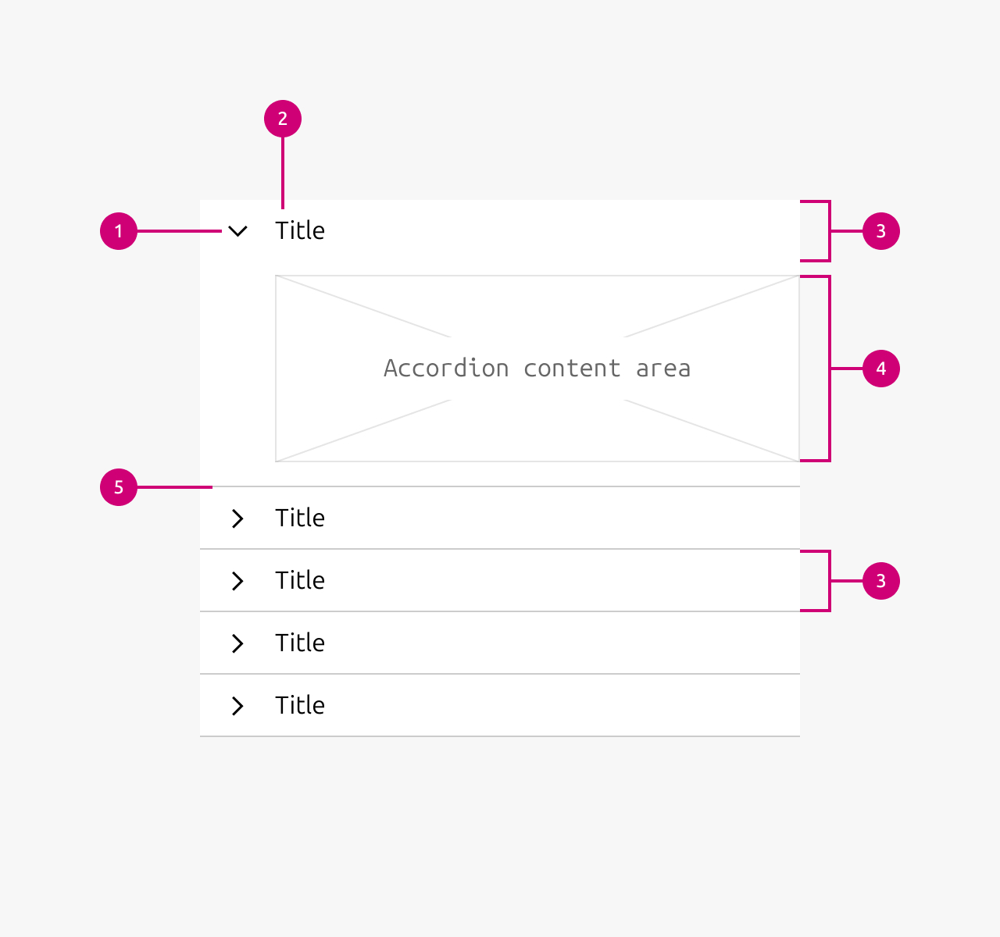

1.  **Chevron:** Indicates wether the accordion item is open or closed. It points down when open and points right when closed.
2.  **Heading:** The heading indicates what the subject of the contents is.
3.  **Tab:** The tab is the clickable area of the accordion with which the accordion can be opened and closed.
4.  **Panel:** The panel is the area in which the content of the accordion item can be placed.
5.  **Divider:** The divider at the end of an accordion indicates the end of an accordion item.