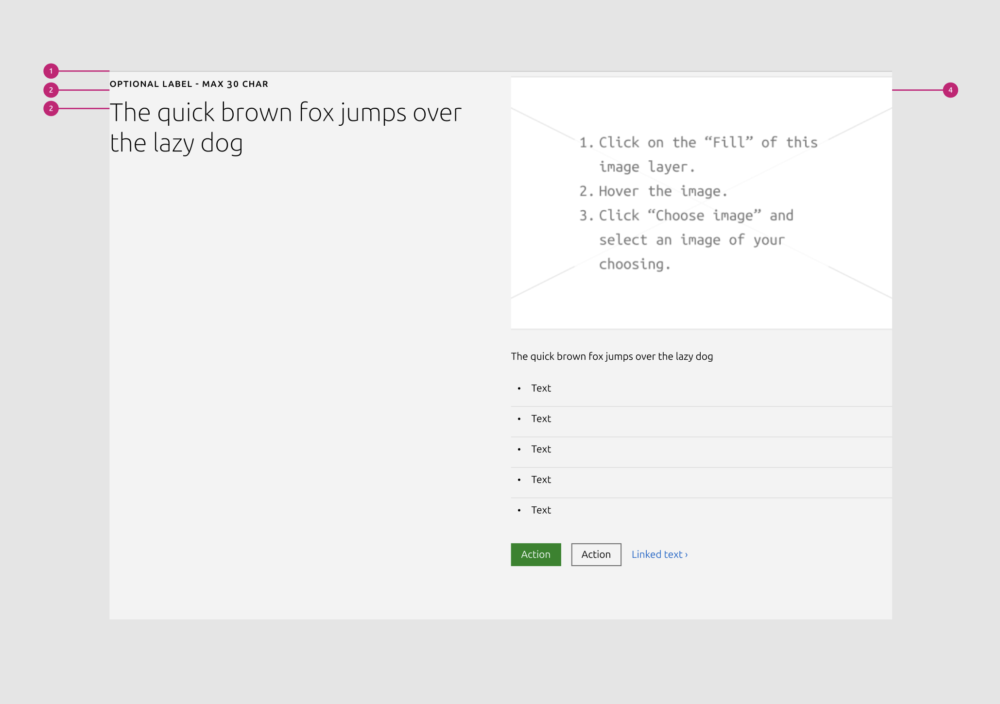

1.  **Rule** p-rule : The rule component indicates the beginning of a new section.
2.  Title title : The title of the section is
3.  Label label\_text (optional): Optional muted heading above the title.
4.  Content blocks:

  

### Content blocks

1.  Subtitle subtitle :
2.  Description
3.  Image
4.  Video
5.  List
6.  Code block code-block :
7.  Logo block logo-block :
8.  Linked logo block linked-logo-block :
9.  CTA block cta-block :
10.  [Notification](https://coda.io/d/_d_MEO4xiNKu#UI-Blocks_tuOF6n4R/r15&view=center) notification :