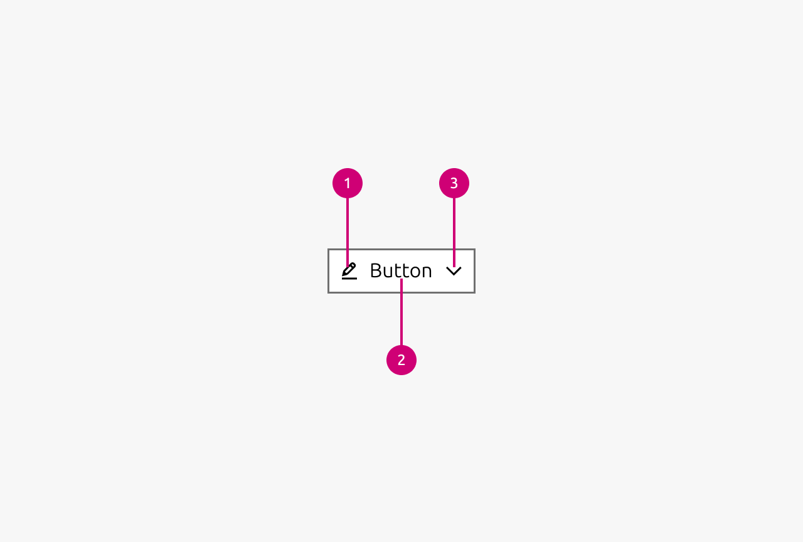

1.  **Icon left:** The icon to the left side of the button can be used to give additional visual context to the user what sort of action this button performs. For example an edit action can be additionally visually indicated by an edit icon.
2.  **Text:** The text of the button is used to tell the user what sort of action this button performs. It should be set to something that gives the user a clear understanding which action is being performed when executing the button.
3.  **Icon right:** The right icon is used less frequently and typically serves a different purpose than the left icon. Rather than providing additional context about the primary action, it usually indicates secondary behavior or UI affordances. For example, a chevron icon might signal that the button opens a contextual menu, or expandable content. This positioning helps users understand that there's additional functionality beyond the main action described in the button text.