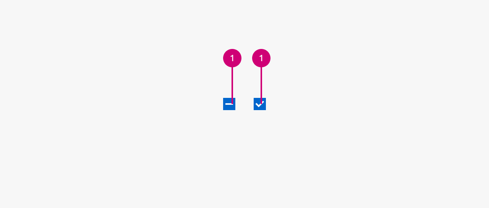

1.  **Checkmark:** If checked the checkbox shows a checkmark. This checkmark can either be a dash if only children in, for example, a table are selected or a common checkmark if the item itself is selected.