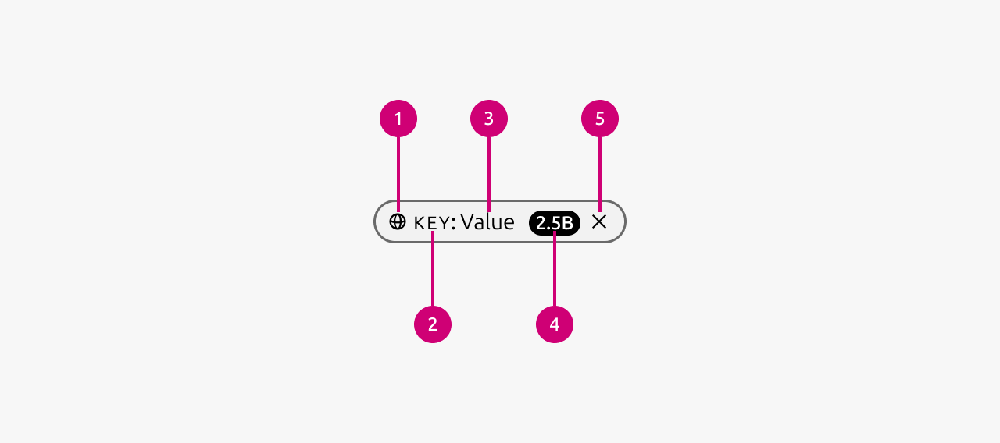

1.  **Icon:** The icon can be used to give more context to the chip. All icons from Vanilla are available. Note that semantic icons should only be used with the appropriate color (warning icon with yellow for example).
2.  **Lead:** If the value is of a certain category then the key can be used to show that category to provide additional context to the user.
3.  **Value:** The primary textual information that the chip represents.
4.  **Badge:** The badge can be used to show numerical information. For example the amount of items which fall under a certain filter. See more in the badge documentation.
5.  **Dismiss button:** If present allows to dismiss the chip. For example if an applied filter needs to be removed.