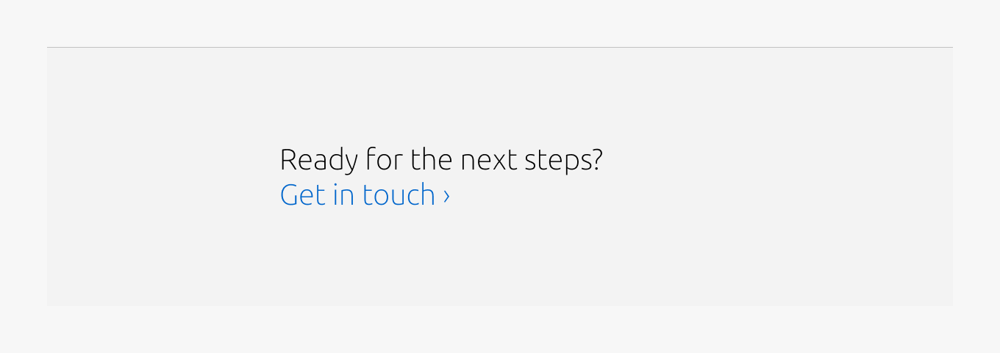
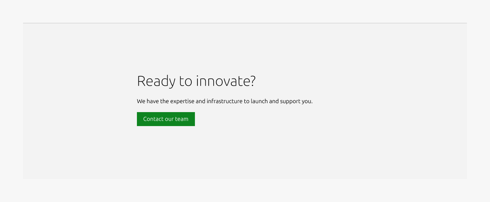
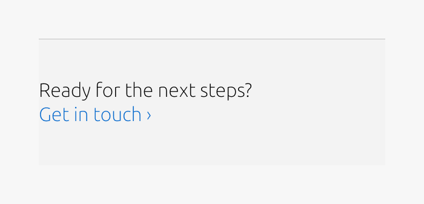
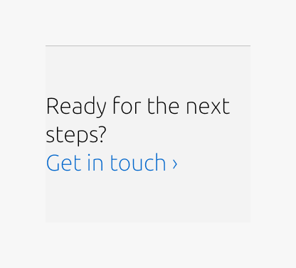

# CTA section

## Description

The CTA section is a prominent and visually engaging section designed to encourage users to take a clear next step. It combines a concise copy and one or more call-to-action elements into a focused layout that stands out from surrounding content. This pattern is typically used mid-page or near the end of a page to re-engage users and guide them toward a specific action such as downloading resources, contacting sales, or exploring key documentation. The CTA section helps reduce decision friction by clearly communicating what the action is and why it matters now.

## Metadata

- **Type**: Pattern
- **Tier**: Sites
- **Documentation Status**: Minimal
- **Last Edited**: Feb 10, 2026
- **Figma**: [View in Figma](https://www.figma.com/design/1brHCsyeTE6FU7hfJd6ao2/%F0%9F%8C%90-Sites---Core-component-library?node-id=211-14507)
- **Code**: [View on GitHub](https://github.com/canonical/vanilla-framework/blob/main/templates/_macros/vf_cta-section.jinja)

## Anatomy

### 1. Rule

The rule component indicates the beginning of a new section.

### 2. Heading

A concise, action-oriented heading that communicates the purpose of the call to action.

### 3. CTA

The interactive element(s) that trigger the intended action. Depending on the variant, this may appear as:
One or more inline text links (link-style CTA), or
A dedicated CTA block containing buttons or structured actions
This element is required and represents the functional core of the CTA section.

### 4. Body

Optional supplementary body text used to explain the reason for the action.
This element is available only in the block variant and appears directly beneath the heading.

## Usage

Use the CTA section to highlight a clear, intentional next step within the page flow. This pattern is designed to create a moment of focus, helping users transition from consuming information to taking action.  
CTA sections are typically placed mid-page or near the end of a page, where users have enough context to understand the value of the action being proposed.

The CTA section should represent a single primary intent. Any supporting text or additional elements should reinforce this intent rather than introduce new topics.

  

### When to use

*   A specific user action is the primary purpose of the section, not a secondary affordance.
*   You need to visually separate a call to action from surrounding content to increase emphasis.

### When not to use

*   If long-form explanatory content is needed, use a Basic section with the CTA block instead.
*   The CTA appears too early in the page flow, before users have sufficient context to understand its value.

## Examples

### Layout

100(Default)

100(CTA block)

25/75(Default)

25/75(CTA block)

### Responsive

Medium dimension (Default)

Medium dimension (CTA block)

Small dimension (Default)

Small dimension (CTA block)

## Properties

| Name | Type | Required | Description | Constraint | Options | Default |
|------|------|----------|-------------|------------|---------|----------|
| Top padding | single select | Yes | The type of padding applied to the top of the pattern after the section rule | - | - | deep |
| Body | string | No | 4-column width body text | 300 (As part of a highlighted section, the content should be limited to a single sentence.) | - | - |
| Heading | string | No | 8-column width heading using H2 | Up to 60 characters | - | - |
| Bottom padding | single select | Yes | The type of padding applied to the bottom of the pattern | - | - | deep |
| Section rule | single select | Yes | The rule component indicates the beginning of a new pattern | Only use the default style for the section-level rule | default | default |
| Link CTA | string | No | The text link used for contextual actions or pathways to more information. It uses a chevron (›) to indicate navigation to additional content or pages. | Up to 60 characters | - | - |

