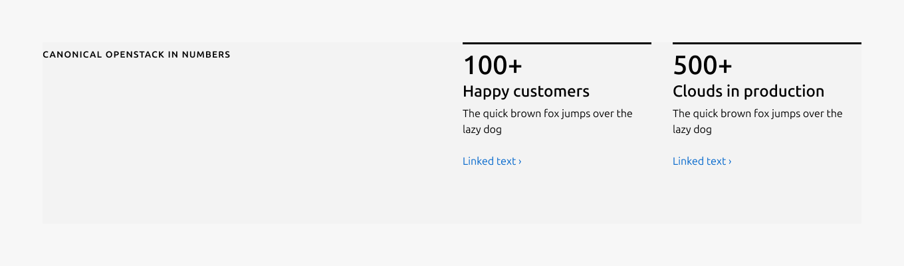
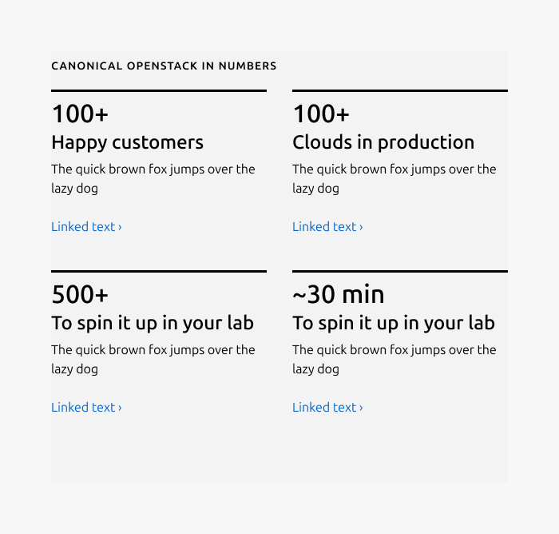
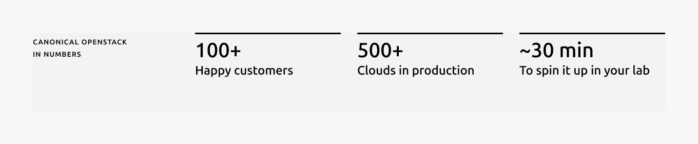
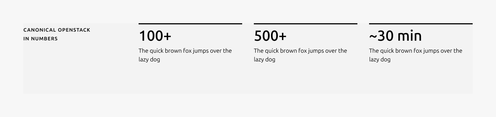
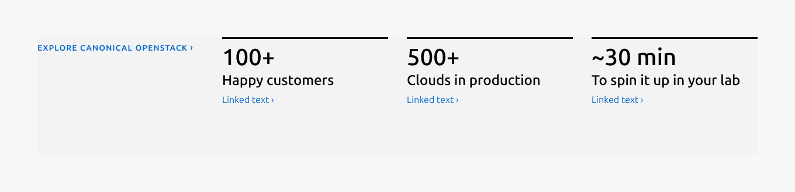

# Data spotlight

## Description

The data spotlight pattern presents key statistics as the primary content, supported by short headlines and optional descriptions. It is designed to surface important numbers in a clear, scannable layout that helps users quickly understand impact, scale, or outcomes.

## Metadata

- **Type**: Pattern
- **Tier**: Sites
- **Documentation Status**: Minimal
- **Last Edited**: Feb 10, 2026
- **Figma**: [View in Figma](https://www.figma.com/design/1brHCsyeTE6FU7hfJd6ao2/%F0%9F%8C%90-Sites---Core-component-library?node-id=332-14533)
- **Code**: [View on GitHub](https://github.com/canonical/vanilla-framework/blob/main/templates/_macros/vf_data-spotlight.jinja)

## Anatomy

### 1. Heading

The section heading communicates the primary subject or theme of the section.

### 2. Block rule

The rule component indicates and visually highlights the start of each block.

### 3. Numeric stat

The numeric stat displays the primary data point for the block.

### 4. Headline

The headline labels and clarifies what the numeric stat represents.

### 5. Description

The description provides optional supporting context for the data point.

### 6. Link

The link is an optional element that directs users to more detailed or related information.

## Usage

The data spotlight pattern is used to present key numeric information as the primary focus of a section, allowing users to quickly scan and understand important metrics at a glance. It is composed of a visually emphasized blocks that combines a highlight rule, a numeric stat with a short headline, optionally supported by a brief description and a link for further exploration. The pattern supports 2–4 blocks, with strict character limits to ensure clarity and visual consistency.

### Contents guide

*   Use numeric values to represent measurable data points
*   Keep stats concise and scannable, with a maximum of 10 characters
*   Units or numeric modifiers may be included when needed (for example: %, x, min, +, \-, ~)
*   Use abbreviations and symbols to improve readability at a glance
*   Prefer compact numeric expressions over spelled-out text

**Abbreviation guidelines**

*   Use + instead of “more than” (for example, 10+)
*   Use ~ instead of “up to” or “approximately” (for example, ~10)
*   Use abbreviated units such as min, sec, hrs instead of full words

**Good examples**

*   10+
*   ~10
*   99.9%
*   3x
*   15 min

**Avoid**

*   Spelled-out units or phrases (for example, “minutes”, “more than 10”)
*   Long or complex expressions that reduce scannability
*   Combining multiple values in a single stat

### When to use

*   To draw attention to important data points or achievements
*   To support a story with clear, easy-to-digest numbers
*   To summarize key metrics in a simple and consistent layout

### When not to use

*   When the content is descriptive text rather than numeric data, please use Text spotlight instead
*   When you have fewer than 2 or more than 4 stats
*   When detailed explanations are required instead of concise highlights

## Examples

### **Layout**

Large dimension (4 blocks)

Large dimension (3 blocks)

Large dimension (2 blocks)

Medium dimension (4 blocks)

Medium dimension (3 blocks)

Small dimension

### **Usage example**

Without description

Without description and link

Without headline

Link style heading

## Properties

| Name | Type | Required | Description | Constraint | Options | Default |
|------|------|----------|-------------|------------|---------|----------|
| Body | string | No | 2-column width body text | 300 (As part of a highlighted section, the content should be limited to a single sentence.) | - | - |
| Data spotlight block | object | Yes | This block consists of the required highlight rule, stat, along with an optional headline, description and link. 2, 3 or 4 blocks can be used within the pattern. The height is determined by the item with the longest line in the same row. | - | 2 blocks, 3 blocks, 4 blocks | - |
| Headline | string | No | Optional 2-column width headline text with H3 style for each stat. | Up to 20 characters | - | - |
| Block rule | object | Yes | The rule component used to emphasize each data block and create separation. | - | highlight | highlight |
| Numeric stat | string | Yes | 2-column width stat text with H1 style  | Up to 10 characters | - | - |
| Heading | string | Yes | 2-column width heading using muted heading | Up to 60 characters | - | - |
| Linked heading | single select | No | The heading can be used as a link when paired with a chevron(›) and a clear indication. | - | default, link | default |
| Link CTA | string | No | The text link used for contextual actions or pathways to more information. It uses a chevron (›) to indicate navigation to additional content or pages. | Up to 60 characters | - | - |
| Bottom padding | single select | Yes | The type of padding applied to the bottom of the pattern | - | default, deep, shallow, none | default |

