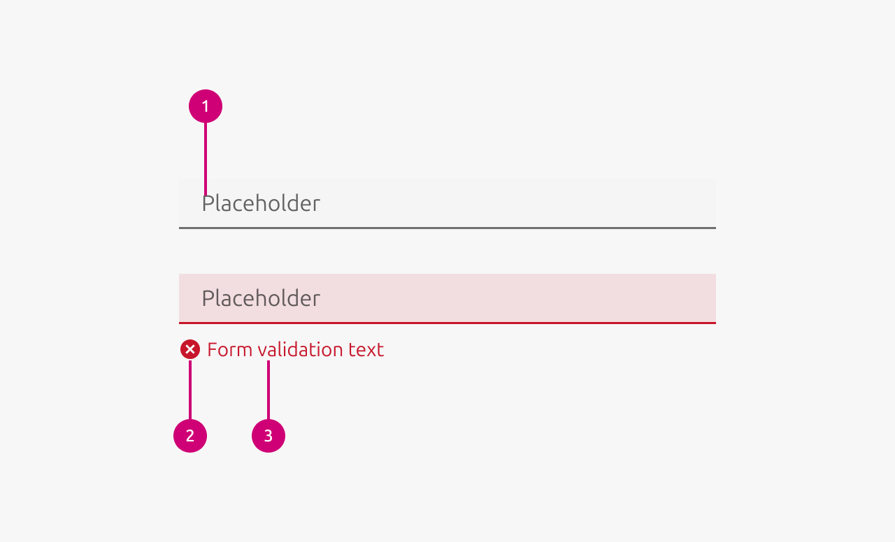

1.  **Text:** Either the placeholder text or, after the user starts typing, the text that the user typed.
2.  **Input validation icon:** A supplementary icon indicating the type of input validation.
3.  **Input validation text:** The text that describes the input validation that has taken place.