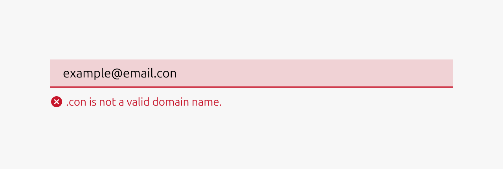
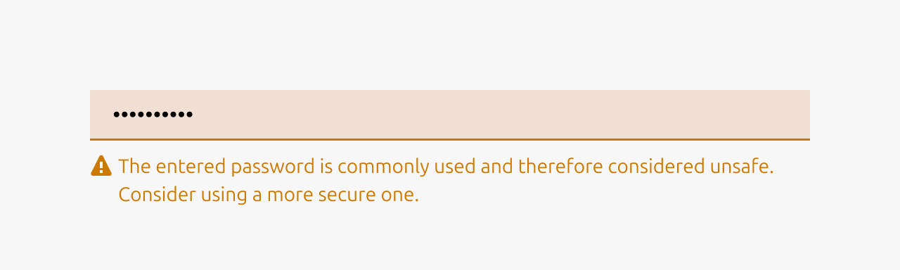
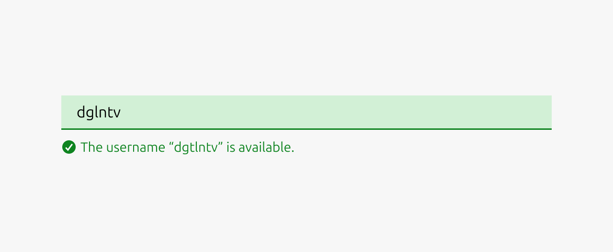

# Input

## Description

The input component allows users to enter and edit text-based data. It provides a standardized interface for collecting user input such as names, email addresses, passwords and other textual information.

## Metadata

- **Type**: Component
- **Tier**: Global
- **Documentation Status**: Minimal
- **Last Edited**: Dec 15, 2025
- **Figma**: [View in Figma](https://www.figma.com/design/Y0cqKbTG4rejU9xm2oh5pR/%F0%9F%92%A0-Vanilla---Core-component-library?node-id=2066-28)
- **Code**: [View on GitHub](https://www.figma.com/exit?url=https%3A%2F%2Fgithub.com%2Fcanonical%2Fvanilla-framework%2Fblob%2Fb1d651365b0714586e6ea14349dea763819c256e%2Fscss%2F_base_forms.scss%23L14)

## Anatomy

### 1. Text

Either the placeholder text or, after the user starts typing, the text that the user typed.

### 2. Input validation icon

A supplementary icon indicating the type of input validation.

### 3. Input validation text

The text that describes the input validation that has taken place.

## Usage

The input component is used to collect short to medium-length free-form text from users. It serves as the primary method for gathering information when the exact data format or content isn't predetermined by the system. Input fields are essential for forms and data entry workflows where users need the flexibility to enter custom text rather than selecting from predefined options.

### Input validation

Use validation states to provide real-time feedback about the quality and validity of user input. This helps users understand whether their input meets requirements before attempting to submit a form, reducing errors and improving the overall user experience.

**Error input validation**

*   Input is invalid and would prevent successful form submission
*   Required fields are left empty after the user has interacted with them
*   Input format is incorrect (invalid email address, phone number, etc.)
*   Input violates business rules or constraints (password too short, username already taken)
*   User input contains forbidden characters or content

**Example scenarios:** Invalid email format, password doesn't meet requirements, required field left blank, numeric input contains letters.

  

**Warning input validation**

*   Input is technically valid but potentially problematic or unusual
*   Suggesting improvements that aren't strictly required
*   Alerting users to potential issues that won't block submission
*   Input might cause complications or confusion later
*   Recommending best practices or alternative approaches

**Example scenarios:** Weak but acceptable password, unusual email domain, input that might be misinterpreted, using non-standard formatting.

  

**Positive input validation**

*   Complex validation requirements are successfully met
*   Confirming that corrected input now passes validation
*   Input meets high-quality standards or best practices
*   Providing reassurance for critical or complex fields
*   Real-time confirmation helps reduce user anxiety

**Example scenarios:** Strong password created, email format verified, unique username available, complex requirements satisfied.

**Note:** Use positive states sparingly - not every valid input needs positive confirmation, as this can create visual noise.

### When to use

*   Collecting short to medium-length text from users (names, emails, addresses)
*   Gathering numerical data like quantities, prices, or measurements
*   Ideally the expected input format is predictable and can be validated
*   Creating forms such as user registration, login, or profile management
*   Building configuration panels where users set preferences or parameters

### When not to use

*   Users need to enter long-form text (use textarea instead)
*   Presenting users with a predefined set of options (use dropdowns, radio buttons, or checkboxes)
*   Input data has a complex format that's difficult to type (use specialized pickers for dates, times, colors)
*   You are collecting binary yes/no information (use toggles or checkboxes)
*   Users need to upload files (use file upload components)
*   The input requires rich formatting like bold, italics, or links (use rich text editors)

## Properties

| Name | Type | Required | Description | Constraint | Options | Default |
|------|------|----------|-------------|------------|---------|----------|
| Placeholder | string | No | The placeholder text that is being shown if there has not been any text that has been entered yet. | - | - | - |
| Text | string | No | The text that is in the input field.  | - | - | - |
| Size | single select | No | The vertical density of the input element | - | default, dense | default |
| Input validation text | string | No | If the input is being validated the outcome / reason of the input validation | - | - | - |
| Input validation type | single select | No | If the input is being validated what type of input validation it is. | - | none, error, warning, positive | none |
| State | single select | No | The state the input is currently in. | - | default, hover, active, disabled | default |

## Change Log

### Nov 21, 2025 - Maximilian Blazek

Initial commit

