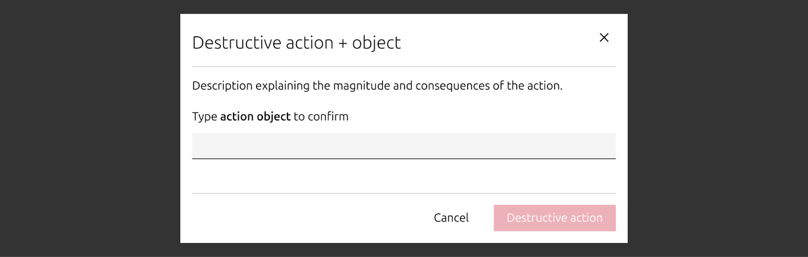
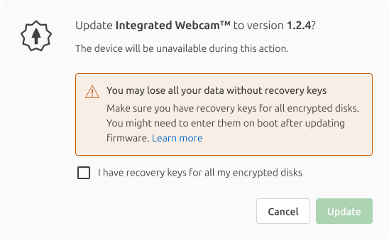
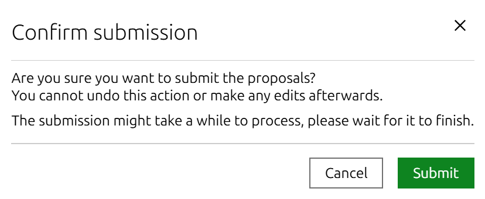
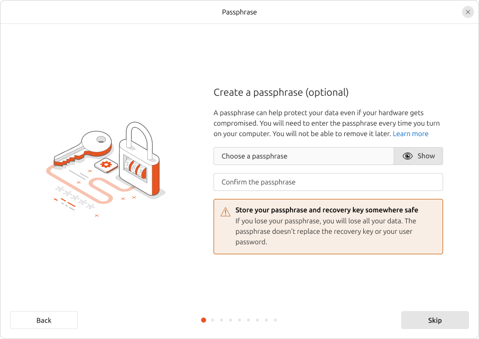

It is sometimes desirable to introduce some friction in flows so users are fully aware of risks and take any irreversible or destructive actions knowingly. This friction is not supposed to be a substantial nuisance that keeps the user from acting deliberately, but instead a guardrail to prevent accidental interactions.

​For instance, a user using a wizard may be tempted to click repeatedly on the “Next” button. This may be OK in many cases. For instance, the defaults for the Ubuntu installer may work well enough when setting up a virtual machine. However, you may decide to disable that “Next” button in critical steps to prevent the user from taking destructive actions (like wiping a drive or not saving their recovery key) without explicitly acknowledging the risks (losing their data).

## Blocking friction

Adding friction that blocks the user from continuing the flow unless taking a very deliberate action is ideal for **destructive** actions.

For destructive actions, you may:

*   **Ask the user to type a word:** you may ask the user to type either the name of the action (e.g. “delete”) or the name of the object that will be destroyed (e.g. a VM or repository name).

  

​

For _potentially_ destructive actions, you may:

*   **Ask the user to acknowledge risk**: similar to the way we collect legal consent, it should be voiced in first tense, e.g. “I understand the risk”, ideally explaining the risk (e.g. “I understand all my data may get lost”. This is a well established pattern in registration forms, so we can expect users to understand what it conveys.
*   **Ask the user to confirm they have taken precautions**: if there is any action that the user can take to avoid the actions becoming destructive (e.g. “I have recovery keys for all my encrypted disks”)

  

## Non-blocking friction

Non-blocking callouts are ideal for **mildly problematic or irreversible, non-destructive** actions. Example: FIPS is an advanced option in Ubuntu Pro that facilitates compliance with government standards, so it’s only useful for a minority of users. Once enabled, it cannot be disabled and Livepatch is permanently disabled.

​

In these cases, you may:

*   **Add a dialog to confirm the action**: It will add one extra step to the process, and the distinctive design will help grab the user's attention, but it will only add one extra click.

  

​

*   **Show a warning message**: May be good enough for irreversible, non-destructive actions
*   *   Use [caution notification](https://vanillaframework.io/docs/patterns/notification#caution) in Vanilla or warning info panel in Yaru.

  

​You may also rely on **obscurity**. If an action is only supposed to be used by advanced users that know what they are doing, or in very specific circumstances, you may choose to make the option less visible, or to use technical language that will discourage users from playing with it. This will force users to be more deliberate, perhaps by relying on fully-fledged documentation that can provide full context.