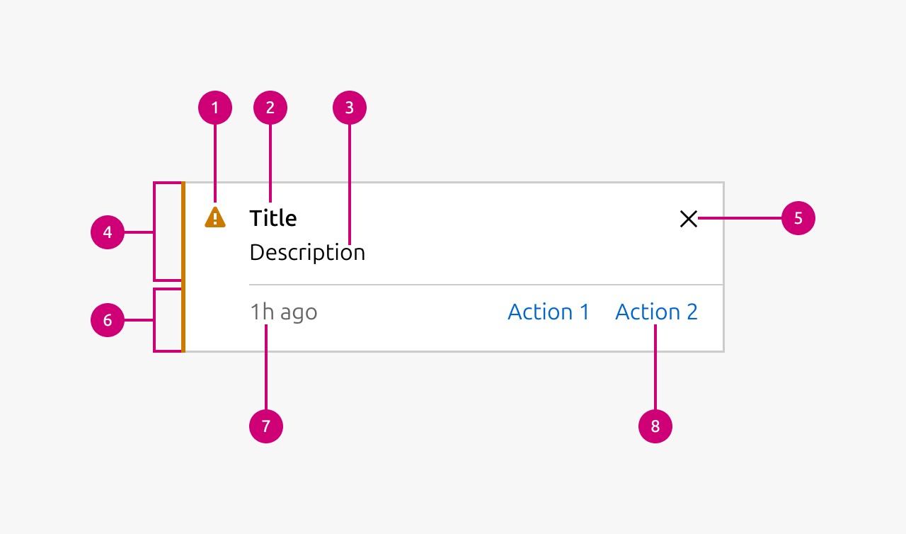

1.  **Icon:** The icon gives additional visual information what type of notification this is.
2.  **Title:** The title of the notification is a short description of the message that is being conveyed to the user. Shouldn’t be too long.
3.  **Description:** A more in detail description of the message that is being conveyed to the user. This is supposed to give the user full context of what you are trying to tell them.
4.  **Content section:** This is the main content section of the notification. It contains the Icon, title, description and dismiss button.
5.  **Dismiss button:** The dismiss button allows the user to dismiss the notification.
6.  **Timestamp & action section:** If a timestamp or actions need to be shown as part of the notification then this section is shown. It contains the timestamp and actions.
7.  **Timestamp:** The timestamp gives an indication when the event that triggered the creation of the notification happened.
8.  **Actions:** Allows you to provide actions the user can take based on the notification.