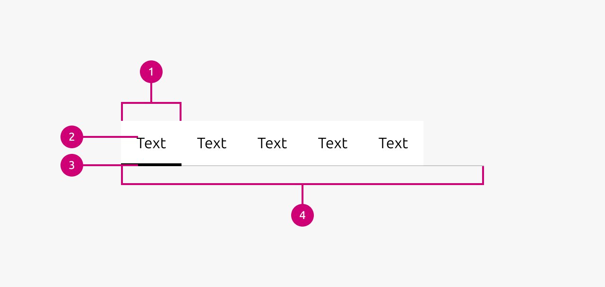

1.  **Tab:** An individual clickable element that acts as a trigger to display its associated content panel. Each tab represents a distinct section of related content.
2.  **Tab text:** The label displayed within each tab that describes the content it represents. This text should be concise and clearly indicate what content will be shown when selected.
3.  **Active tab indicator:** A visual element that appears beneath the currently selected tab. Only one tab can ever be active at a time.
4.  **Tab group:** The horizontal container that houses all individual tabs together. It organizes the tabs in a row and a line that runs along the bottom.