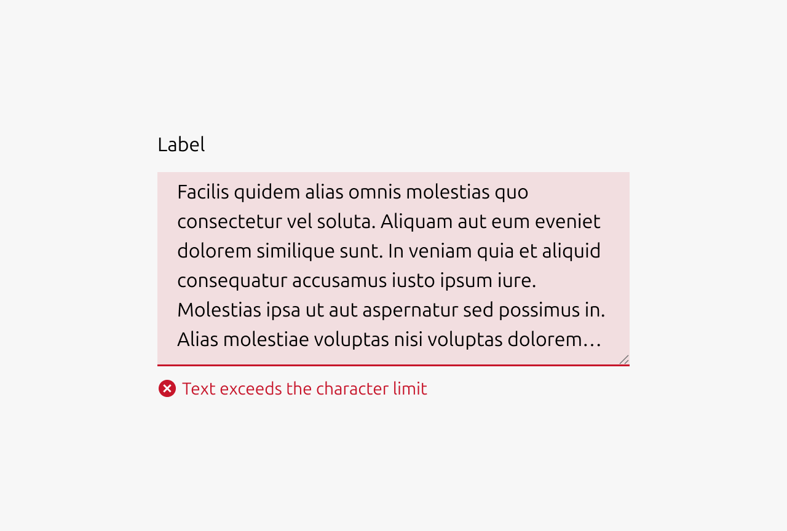
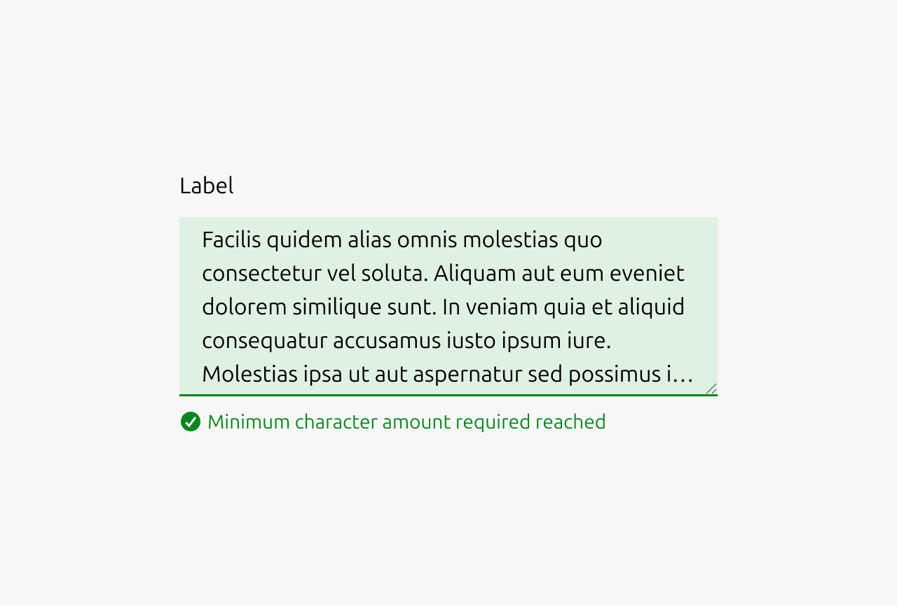

A text area is an input component that allows users to enter multiple lines of text. It is used in cases where users need to provide longer form content, such as writing a comment, note, or description. Text areas are commonly found in forms, comment threads, feedback sections, and anywhere users need space to input text beyond a single line.

### When to Use

*   Users need to input multiple lines of text
*   Collecting longer form content such as comments, notes, descriptions, or feedback
*   Forms requiring open-ended responses
*   Comment threads or discussion interfaces

### When Not to Use

*   Single-line inputs are sufficient (use a text input instead)
*   Collecting structured data with a known format (consider more specific input types)
*   Rich text formatting is required (use a rich text editor instead)

### Resizing Behavior

Text areas should almost always be restricted to vertical resizing only. Horizontal resizing is rarely necessary and can easily break the surrounding layout. Text areas should grow automatically as the user types (for example using the CSS property field-sizing: content). This creates a more natural writing experience and prevents users from having to manually resize the component to see their full input.

### Saving and user assurance

Users should always be reassured that their content has been saved. In a traditional form context, a submit button provides this assurance. When users click submit, they understand their input has been captured. However, if the text area uses auto-saving, assurance must be provided through other means, such as a "Saved" indicator or timestamp.

When implementing auto-save, the save action should occur on change while the user is typing, but with a debounce to avoid overloading the backend. Use a debounce wait time of 500ms, with a maximum wait of 10 seconds. The maximum wait ensures that even during continuous typing, the content is periodically saved.

### Character Limits

Text areas can display a character count indicator and enforce a maximum number of characters. If a maximum is reached, users should not be prevented from typing beyond the limit. Instead, display a validation error when the limit is exceeded. This approach avoids frustrating users who paste content that would otherwise be silently truncated, and allows users who are typing to finish their thought before editing down to meet the requirement.

### Placeholder Text

Never use placeholder text as a substitute for labels. If placeholder text is used, it should serve as an example or hint rather than instructions. For instance, if the expected input is a comma-separated list, showing an example list can be helpful. Avoid repeating the label in the placeholder, as this provides no additional value. Most importantly, never put crucial information in placeholder text. Users should be able to understand what is required without it, since placeholder text disappears once they begin typing.

### Input validation

Use validation states to provide real-time feedback about the quality and validity of user input. This helps users understand whether their input meets requirements before attempting to submit a form, reducing errors and improving the overall user experience.

**Error input validation**

*   Input is invalid and would prevent successful form submission
*   Required fields are left empty after the user has interacted with them
*   Input format is incorrect (character amount exceeds limit)
*   User input contains forbidden characters or content

**Example scenarios:** Character amount exceeds limit, required field left blank

  

**Warning input validation**

*   Input is technically valid but potentially problematic or unusual
*   Suggesting improvements that aren't strictly required
*   Alerting users to potential issues that won't block submission
*   Input might cause complications or confusion later
*   Recommending best practices or alternative approaches

**Example scenarios:** Contains content which should not be shared publicly, contains offensive language

  

**Positive input validation**

*   Complex validation requirements are successfully met
*   Confirming that corrected input now passes validation
*   Input meets high-quality standards or best practices
*   Providing reassurance for critical or complex fields
*   Real-time confirmation helps reduce user anxiety

**Example scenarios:** Minimum character amount reached

**Note:** Use positive states sparingly - not every valid input needs positive confirmation, as this can create visual noise.