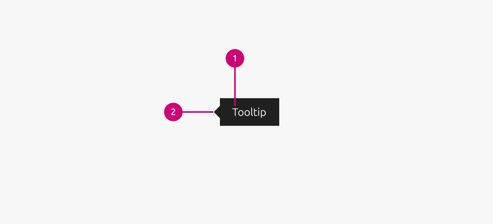

1.  **Tooltip text:** The main content area that contains the informational text or message displayed to the user. This text should be concise and provide helpful context or additional details about the associated element.
2.  **Arrow:** A small triangular pointer that visually connects the tooltip to its trigger element. The arrow indicates which UI element the tooltip information refers to and helps establish the relationship between the tooltip and its target.